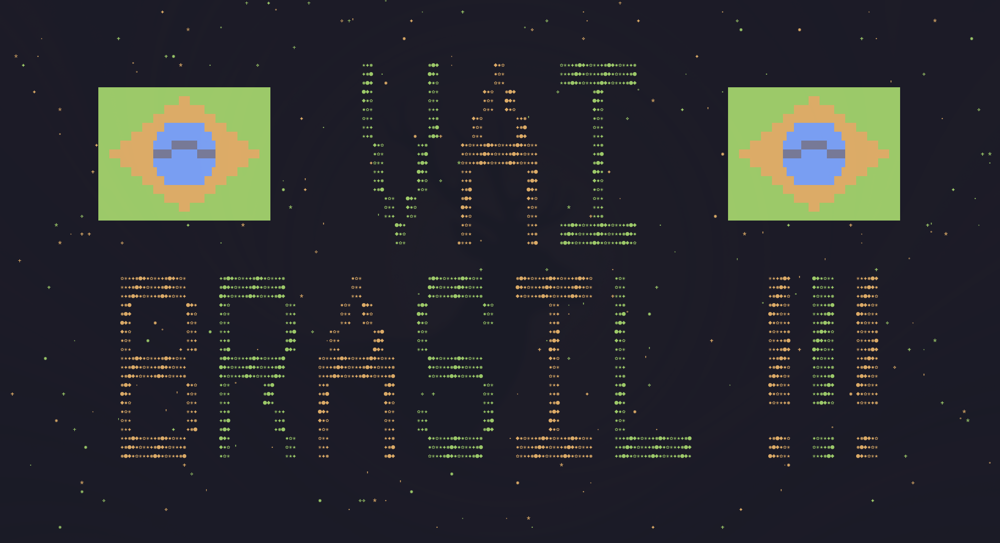

# VAI BRASIL !!! 🇧🇷

Banner verde e amarelo em tela cheia para o terminal: **"VAI BRASIL !!!"** em
letras gigantes tecidas com símbolos UTF-8, bandeiras do Brasil desenhadas
geometricamente e um céu estrelado ao fundo. Feito para tirar aquele print
e postar nas redes em dia de jogo.



## Como usar

Só precisa de Python 3 (sem dependências externas):

```bash
python3 vai-brasil.py
```

1. Coloque o terminal em **tela cheia** (quanto maior a janela, maiores as letras).
2. Rode o script — o banner fica na tela com o cursor escondido.
3. Tire o print.
4. Aperte **Enter** (ou `Ctrl+C`) para sair e restaurar o terminal.

Cada execução gera um céu estrelado diferente; se não gostar do sorteio,
rode de novo.

## Requisitos

- Python 3 (qualquer versão razoavelmente recente).
- Terminal com suporte a cores ANSI e UTF-8 — ou seja, praticamente
  qualquer terminal moderno (Alacritty, Ghostty, Kitty, foot, GNOME
  Terminal, Windows Terminal...).
- Uma fonte monoespaçada que renderize os símbolos (`★ ✦ ● ◆ ✸ ✿ ☀`) com
  largura de 1 célula. Fontes comuns de programação (JetBrains Mono, Fira
  Code, Cascadia, Nerd Fonts em geral) funcionam bem.

## Como funciona

- Uma **grade** do tamanho do terminal guarda pares `(caractere, cor)`;
  tudo é desenhado nela e impresso de uma vez só.
- As letras vêm de uma **fonte bitmap** de 7 linhas (desenhada com `#` no
  código) e são ampliadas para preencher a tela. "BRASIL !!!" define a
  escala e ocupa toda a largura; "VAI" usa letras do mesmo tamanho,
  centralizado.
- As **bandeiras** não são arte pronta ampliada: cada célula é classificada
  por geometria (losango por distância manhattan, círculo por distância
  euclidiana corrigida pelo aspecto da célula, faixa branca por uma banda
  em torno de uma parábola).

## Personalizando

O código é comentado pensando em quem quer mexer. Atalhos:

| O que mudar                     | Onde                             |
| ------------------------------- | -------------------------------- |
| Texto do banner                 | lista `texts` em `main()`        |
| Símbolos das letras             | constante `TEX`                  |
| Símbolos/densidade das estrelas | `SPARKS`, `SPARK_DENSITY`        |
| Cores                           | constantes `G`, `g`, `Y`, `y`, `BL`, `W` |
| Letras novas                    | dicionário `FONT` (desenhe com `#`) |
| Círculo da bandeira achatado    | constante `CELL_ASPECT`          |

A fonte só tem as letras usadas em "VAI BRASIL !!!" — para escrever outra
coisa, adicione as letras que faltam em `FONT` seguindo o mesmo formato
(7 linhas, `#` = tinta, espaço = vazio; a largura pode variar).

## Licença

Use, modifique e compartilhe à vontade.
